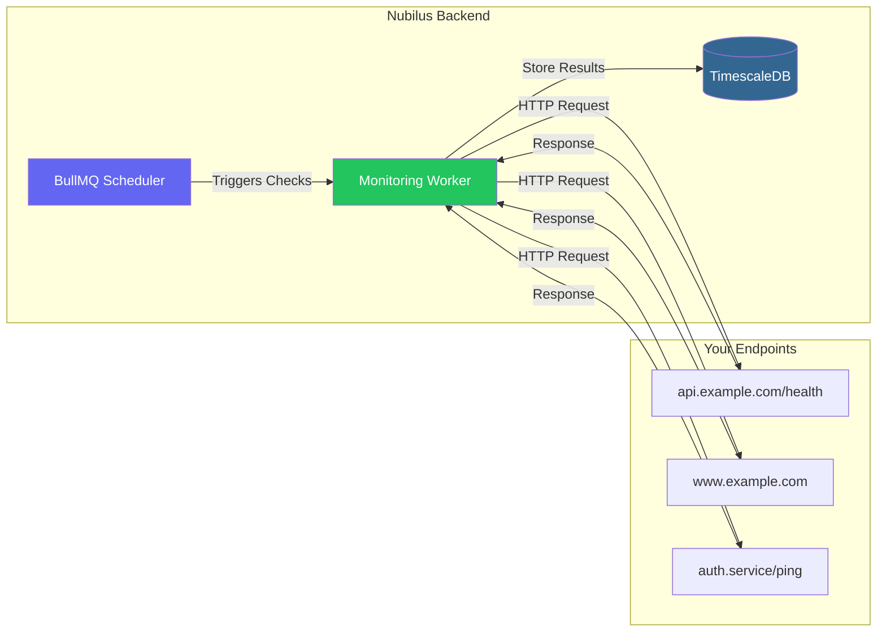
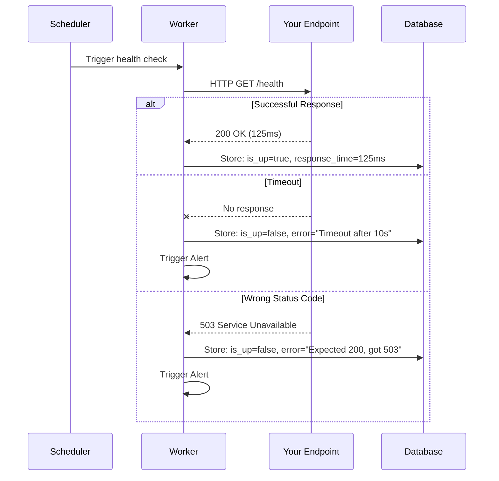
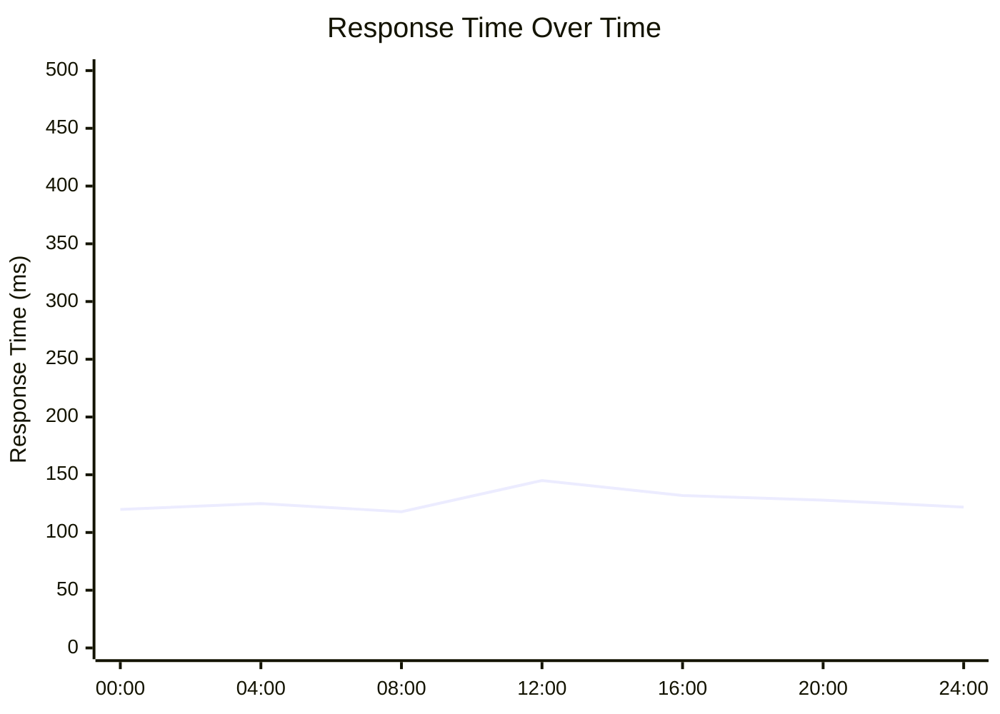

# Endpoint Monitoring

Nubilus provides robust HTTP/HTTPS endpoint monitoring to help you track the availability, response times, and health of your services. Whether you're monitoring APIs, websites, or internal services, Nubilus gives you real-time visibility into your endpoint health.

## Overview



### Key Features

| Feature                     | Description                                                  |
| --------------------------- | ------------------------------------------------------------ |
| **HTTP/HTTPS Checks**       | Monitor any HTTP or HTTPS endpoint with configurable methods |
| **Configurable Intervals**  | Set check intervals from 30 seconds to hours                 |
| **Response Time Tracking**  | Track latency and identify slow endpoints                    |
| **Status Code Validation**  | Verify expected HTTP status codes                            |
| **Immediate Health Checks** | Endpoints are checked immediately upon creation              |
| **Alert Integration**       | Get notified when endpoints go down                          |

## Creating an Endpoint

### Via Dashboard

1. Navigate to **Endpoints** in your organization dashboard
2. Click **"Add Endpoint"**
3. Fill in the endpoint details:

```yaml
Name: Production API Health
URL: https://api.example.com/health
Method: GET
Check Interval: 60 seconds
Timeout: 10 seconds
Expected Status: 200
Tags: api, production, critical
```

4. Click **Create**

> [!NOTE]
> When you create an endpoint, Nubilus immediately performs a health check so you can see the status right away. Subsequent checks will follow the configured interval.

### Endpoint Configuration Options

| Field               | Required | Default | Description                                               |
| ------------------- | -------- | ------- | --------------------------------------------------------- |
| **Name**            | Yes      | —       | A descriptive name for the endpoint                       |
| **URL**             | Yes      | —       | The full URL to monitor (including protocol)              |
| **Method**          | No       | `GET`   | HTTP method: GET, POST, PUT, PATCH, DELETE, HEAD, OPTIONS |
| **Check Interval**  | No       | 60      | Seconds between health checks (minimum 30s)               |
| **Timeout**         | No       | 10      | Seconds to wait before marking check as failed            |
| **Expected Status** | No       | 200     | The HTTP status code that indicates a healthy endpoint    |
| **Tags**            | No       | `[]`    | Optional tags for organizing endpoints                    |

## How Health Checks Work



### Health Check Results

Each health check captures:

- **Status Code** — The HTTP status code returned
- **Response Time** — Total time in milliseconds
- **Is Up** — Boolean indicating if the endpoint is healthy
- **Error Message** — Details if the check failed
- **Timestamp** — When the check was performed

### Status Indicators

| Status        | Badge Color | Meaning                                |
| ------------- | ----------- | -------------------------------------- |
| **Healthy**   | Green       | Endpoint returned expected status code |
| **Unhealthy** | Red         | Endpoint failed the check              |
| **Pending**   | Yellow      | No checks have been performed yet      |

## Viewing Endpoint Details

Navigate to any endpoint to see:

### Overview

- Current status (healthy/unhealthy/pending)
- Last check time
- Response time graph
- Uptime percentage

### Health Check History

View historical health checks with filtering options:

```yaml
# Query Parameters
from: 2024-01-01T00:00:00Z # Start date
to: 2024-01-07T23:59:59Z # End date
limit: 100 # Max results
```

### Response Time Trends



## Endpoint Settings

Configure alerting behavior per endpoint:

| Setting                  | Default | Description                                       |
| ------------------------ | ------- | ------------------------------------------------- |
| **Alerts Enabled**       | `true`  | Enable/disable alerts for this endpoint           |
| **Alert on Down**        | `true`  | Send alert when endpoint goes down                |
| **Consecutive Failures** | 1       | Number of failures before triggering alert        |
| **Alert Cooldown**       | —       | Minutes between repeated alerts (null = no limit) |

## API Reference

### List Endpoints

```bash
GET /api/v1/:orgId/endpoints
```

**Response:**

```json
{
  "success": true,
  "message": "Endpoints retrieved",
  "data": {
    "endpoints": [
      {
        "id": "uuid",
        "name": "Production API",
        "url": "https://api.example.com/health",
        "method": "GET",
        "check_interval": 60,
        "timeout": 10,
        "expected_status_code": 200,
        "enabled": true,
        "status": "healthy",
        "last_checked_at": "2024-01-15T10:30:00Z"
      }
    ]
  }
}
```

### Create Endpoint

```bash
POST /api/v1/:orgId/endpoints
Content-Type: application/json

{
  "name": "My API",
  "url": "https://api.example.com/health",
  "method": "GET",
  "check_interval": 60,
  "timeout": 10,
  "expected_status_code": 200,
  "tags": ["production", "critical"]
}
```

### Update Endpoint

```bash
PUT /api/v1/:orgId/endpoints/:endpointId
Content-Type: application/json

{
  "name": "Updated Name",
  "check_interval": 120,
  "enabled": true
}
```

### Delete Endpoint

```bash
DELETE /api/v1/:orgId/endpoints/:endpointId
```

### Get Health Checks

```bash
GET /api/v1/:orgId/endpoints/:endpointId/checks?from=2024-01-01&to=2024-01-07&limit=100
```

## Best Practices

### Choosing Check Intervals

| Endpoint Type          | Recommended Interval |
| ---------------------- | -------------------- |
| Critical APIs          | 30-60 seconds        |
| Public websites        | 60-120 seconds       |
| Internal services      | 60-300 seconds       |
| Non-critical endpoints | 300-600 seconds      |

### URL Recommendations

> [!TIP]
> Create dedicated health check endpoints in your services:
>
> ```javascript
> // Express.js example
> app.get("/health", (req, res) => {
>   res.status(200).json({
>     status: "healthy",
>     timestamp: new Date().toISOString(),
>   });
> });
> ```

### Timeout Configuration

- Set timeouts slightly higher than your expected response times
- Account for network latency between Nubilus and your endpoints
- Consider geographic distance when setting timeouts

## Troubleshooting

### Endpoint Shows as Unhealthy

1. **Verify the URL is accessible** from the Nubilus server
2. **Check for firewalls** blocking the Nubilus IP
3. **Verify the expected status code** matches your endpoint's response
4. **Check the error message** in the health check details

### Missing Health Checks

1. **Ensure the endpoint is enabled** in settings
2. **Check Redis connection** for the job queue
3. **Verify the monitoring worker** is running

