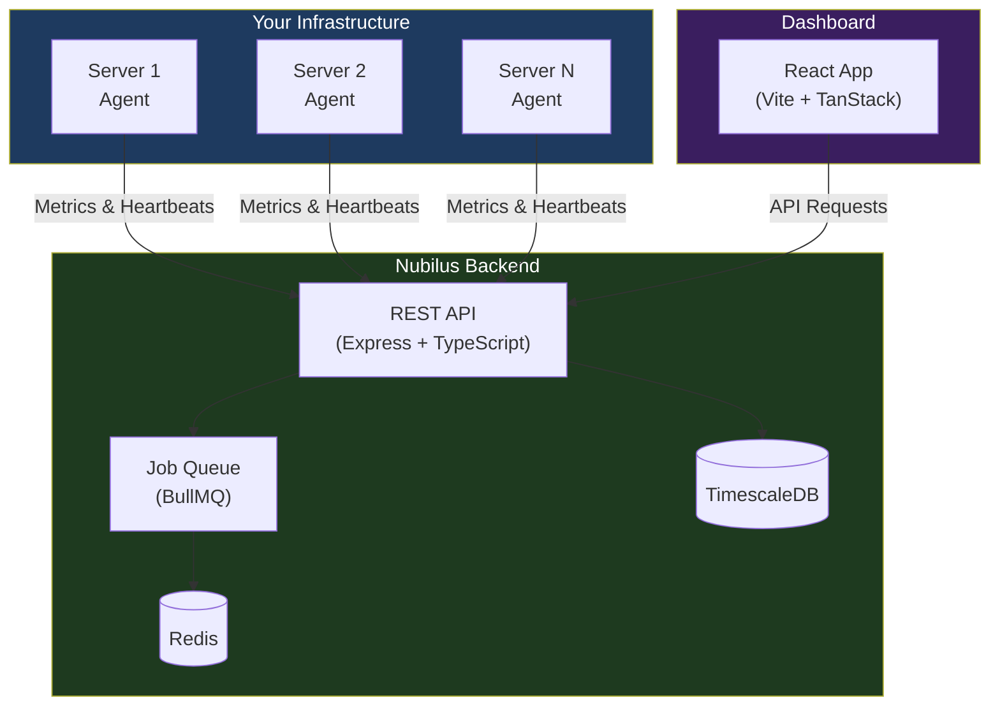
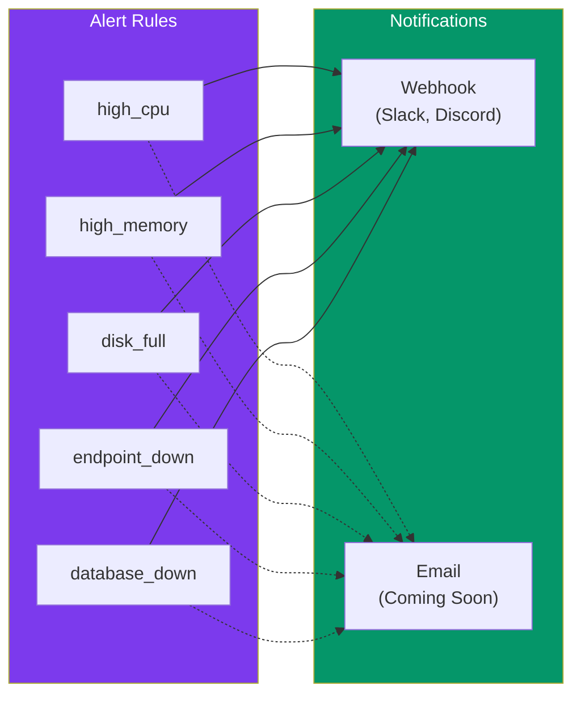
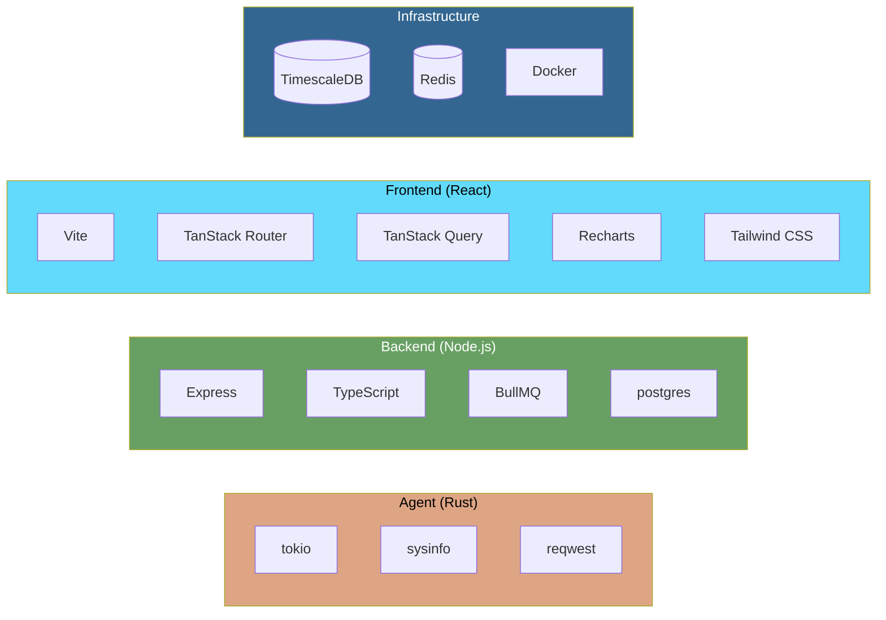

# Introduction to Nubilus

Welcome to **Nubilus** — an open-source, self-hosted infrastructure monitoring platform designed to give you complete visibility into your servers, endpoints, and databases in real-time.

## What is Nubilus?

Nubilus is a comprehensive monitoring solution that empowers developers and DevOps teams to track the health and performance of their entire infrastructure from a single dashboard. Whether you're managing a handful of servers or orchestrating a complex microservices architecture, Nubilus provides the tools you need to stay informed and respond proactively to issues.

### The Name

_Nubilus_ (Latin for "cloudy" or "overcast") reflects the platform's ability to provide clarity and visibility even when your infrastructure landscape seems complex or obscured.

## Why Nubilus?

| Challenge                    | How Nubilus Helps                                       |
| ---------------------------- | ------------------------------------------------------- |
| **Scattered Monitoring**     | Unified dashboard for servers, endpoints, and databases |
| **Expensive SaaS Solutions** | 100% open-source and self-hosted — no vendor lock-in    |
| **Complex Setup**            | Simple one-line agent installation                      |
| **Limited Visibility**       | Real-time metrics with historical trends                |
| **Delayed Alerts**           | Threshold-based alerting with webhook notifications     |

## Architecture Overview

Nubilus follows a modern three-tier architecture:

### Component Summary

| Component    | Purpose                        | Technology                   |
| ------------ | ------------------------------ | ---------------------------- |
| **Agent**    | Collects server metrics        | Rust, tokio, sysinfo         |
| **Backend**  | API, data processing, alerting | Node.js, Express, TypeScript |
| **Frontend** | Visualization dashboard        | React 19, Vite, TanStack     |
| **Database** | Time-series metrics storage    | TimescaleDB (PostgreSQL)     |
| **Queue**    | Background jobs & caching      | Redis + BullMQ               |

## Key Features

### Server Monitoring

Monitor your servers with the lightweight Rust agent:

- **CPU** — Usage percentage, core count, load averages (1m, 5m, 15m)
- **Memory** — Total, used, available with utilization percentage
- **Disk** — Space usage, read/write I/O bytes
- **Network** — Bytes transmitted and received
- **Heartbeat** — Real-time online/offline detection

<!-- coming-soon -->

### Endpoint Monitoring

Keep your services healthy:

- **HTTP/HTTPS Checks** — Automated health checks at configurable intervals
- **Response Times** — Track latency and identify slow endpoints
- **Uptime Tracking** — Historical availability percentages
- **Custom Validation** — Verify expected status codes

### Database Monitoring

Stay connected to your data:

- **Multi-Database Support** — PostgreSQL, MySQL, MongoDB, Redis, MariaDB
- **Connection Health** — Continuous connectivity monitoring
- **Configurable Intervals** — Adjust check frequency per database

### Alerting System

Never miss a critical issue:

<!-- /coming-soon -->

### Multi-Tenancy

Built for teams:

- **Organizations** — Logical grouping for teams and projects
- **API Keys** — Secure, revocable agent authentication
- **Team Invitations** — Invite members via email
- **Permission Management** — Control access within organizations

---

## Tech Stack

---

## Use Cases

| Scenario               | Description                                            |
| ---------------------- | ------------------------------------------------------ |
| **Startup Monitoring** | Self-hosted alternative to expensive SaaS tools        |
| **Homelab**            | Monitor personal servers, NAS, and Raspberry Pis       |
| **DevOps Teams**       | Centralized infrastructure visibility for your team    |
| **Multi-Cloud**        | Unified monitoring across AWS, GCP, Azure, and on-prem |
| **Compliance**         | Keep monitoring data within your own infrastructure    |

---

## Security

Nubilus is designed with security in mind:

- **JWT Authentication** — Secure token-based auth with refresh tokens
- **Password Hashing** — bcrypt-based secure storage
- **API Key Auth** — Revocable keys for agent authentication
- **TLS Support** — Encrypted agent-to-backend communication
- **Cookie Security** — HTTP-only cookies with secure flags

## Contributing

We welcome contributions! Whether it's:

- Bug reports and fixes
- New features
- Documentation improvements
- Test coverage

Please feel free to open issues and submit pull requests on [GitHub](https://github.com/theakash04/Nubilus).

## License

Nubilus is released under the **MIT License**.