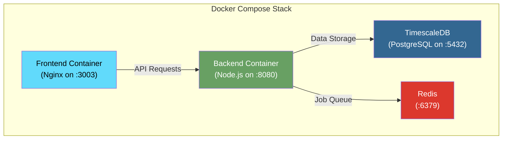
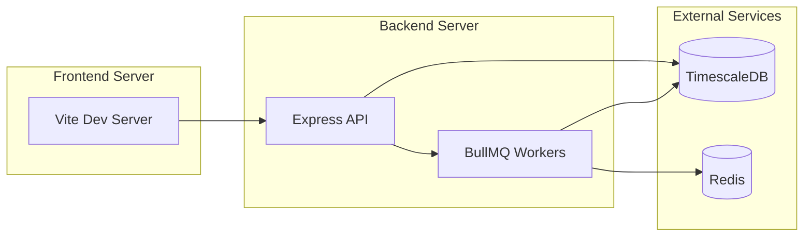
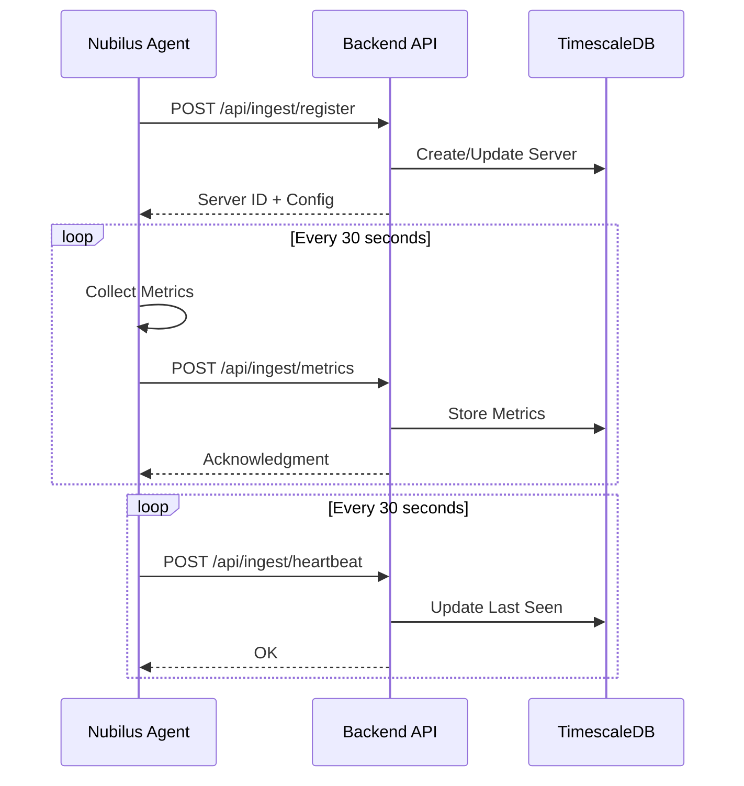

# Installation Guide

This guide covers all installation methods for Nubilus — from quick Docker deployments to manual setups.

## Prerequisites

Before installing Nubilus, ensure you have the following:

| Requirement                 | Minimum | Recommended |
| --------------------------- | ------- | ----------- |
| **Docker**                  | v20.10+ | v24.0+      |
| **Docker Compose**          | v2.0+   | v2.20+      |
| **Memory**                  | 2 GB    | 4 GB+       |
| **Disk Space**              | 5 GB    | 20 GB+      |
| **Node.js** (manual only)   | v18+    | v20+        |
| **Rust** (agent build only) | v1.70+  | v1.75+      |

## Docker Installation (Recommended)

The easiest way to deploy Nubilus is using Docker Compose, which orchestrates all required services.

### Architecture



### Step 1: Clone the Repository

```bash
git clone https://github.com/theakash04/Nubilus.git
cd Nubilus
```

### Step 2: Configure Environment Variables

```bash
# Copy the example environment file
cp .env.example .env
```

Edit `.env` with your configuration:

```bash
# Database Configuration
POSTGRES_USER=nubilus
POSTGRES_PASSWORD=your_secure_password_here
POSTGRES_DB=nubilus
POSTGRES_PORT=5432

# Redis Configuration
REDIS_PASSWORD=your_redis_password_here
REDIS_PORT=6379

# JWT Secrets (generate secure random strings)
JWT_SECRET=your_jwt_secret_minimum_32_characters
REFRESH_TOKEN_SECRET=your_refresh_token_secret_minimum_32_characters
JWT_SESSION_SECRET=your_session_secret

# other conf
PORT=8080
FRONTEND_URL=http://localhost:3000

# API URL (adjust for your domain)
VITE_BASE_URL=http://localhost:8080/api

# user seed
UNAME=user
UPASS=1234secure
UEMAIL=connect@akashtwt.me

# Email configuration
SMTP_HOST=XXXXXXXXXXXXXXXX
SMTP_PORT=XXX
SMTP_PASS=XXXXXXXXXX
SMTP_USER=XXXXXXX
SMTP_FROM=XXXXXXXXXX
```

> [!TIP]
> Generate secure secrets using:
>
> ```bash
> openssl rand -base64 32
> ```

### Step 3: Start the Services

```bash
# Start all services in detached mode
docker-compose up --build -d

# View logs
docker-compose logs -f
```

### Step 4: Verify Installation

```bash
# Check all containers are running
docker-compose ps
```

Expected output:

```
NAME                STATUS              PORTS
nubilus-backend     Up (healthy)        0.0.0.0:8080->8080/tcp
nubilus-frontend    Up                  0.0.0.0:3003->80/tcp
timescaledb         Up (healthy)        0.0.0.0:5432->5432/tcp
redis               Up (healthy)        0.0.0.0:6379->6379/tcp
```

### Step 5: Initialize Database

```bash
# Run database migrations
docker-compose exec backend npm run db:migrate

#  Seed with user creds (required)
docker-compose exec backend npm run db:seed
```

### Access Your Installation

| Service       | URL                       |
| ------------- | ------------------------- |
| **Dashboard** | http://localhost:3003     |
| **API**       | http://localhost:8080/api |

---

## Manual Installation

For development or custom deployments, you can run each component separately.

### System Architecture



### Step 1: Install Dependencies

#### TimescaleDB

```bash
# Using Docker (recommended)
docker run -d --name timescaledb \
  -p 5432:5432 \
  -e POSTGRES_USER=nubilus \
  -e POSTGRES_PASSWORD=your_password \
  -e POSTGRES_DB=nubilus \
  -v timescale_data:/var/lib/postgresql/data \
  timescale/timescaledb:latest-pg17
```

#### Redis

```bash
# Using Docker
docker run -d --name redis \
  -p 6379:6379 \
  redis:7-alpine redis-server --requirepass your_redis_password
```

### Step 2: Setup Backend

```bash
cd backend

# Install dependencies
npm install

# Configure environment
cp .env.example .env
```

Edit `backend/.env`:

```bash
# Server
PORT=8080
NODE_ENV=development

# Database
POSTGRES_HOST=localhost
POSTGRES_PORT=5432
POSTGRES_USER=nubilus
POSTGRES_PASSWORD=your_password
POSTGRES_DB=nubilus

# Redis
REDIS_HOST=localhost
REDIS_PORT=6379
REDIS_PASSWORD=your_redis_password

# JWT
JWT_SECRET=your_jwt_secret
JWT_REFRESH_SECRET=your_refresh_secret

# Frontend URL (for CORS)
FRONTEND_URL=http://localhost:3000
```

```bash
# Run migrations
npm run db:migrate

# Seed database
npm run db:seed

# install dependencies
npm install

# Start development server
npm run dev
```

### Step 3: Setup Frontend

```bash
cd frontend

# Install dependencies
npm install

# Configure environment
echo "VITE_BASE_URL=http://localhost:8080/api" > .env

# Start development server
npm run dev
```

---

## Agent Installation

The Nubilus Agent is a lightweight Rust binary that collects and reports server metrics. It runs on **Linux**, **macOS**, and **Windows**.

### Agent Communication Flow



### One-Line Installation

#### Linux / macOS

```bash
curl -sSL https://github.com/theakash04/Nubilus/releases/latest/download/install.sh | sudo bash
```

#### Windows (PowerShell as Administrator)

```powershell
# Download the installer script
curl.exe -L -o install.ps1 https://github.com/theakash04/Nubilus/releases/latest/download/install.ps1

# Run the installer
powershell -ExecutionPolicy Bypass -File .\install.ps1
```

The installer will:

- Download the binary to `C:\Program Files\nubilus\`
- Create config at `C:\ProgramData\nubilus\agent.toml`
- Add the install directory to your system PATH

After running the installer, you need to register and start the service manually:

```powershell
# Register the Windows service (use 'service' argument, not 'run')
sc.exe create nubilus-agent binPath= "\"C:\Program Files\nubilus\nubilus-agent.exe\" service" start= auto

# Start the service
sc.exe start nubilus-agent
```

### Manual Installation

#### Linux / macOS

```bash
# Download the binary (Linux x86_64)
curl -sSL https://github.com/theakash04/Nubilus/releases/latest/download/nubilus-agent-linux-amd64 \
  -o /usr/local/bin/nubilus-agent

# Make executable
chmod +x /usr/local/bin/nubilus-agent

# Create config directory
sudo mkdir -p /etc/nubilus
```

#### Windows

Download `nubilus-agent-windows-amd64.exe` from the [latest release](https://github.com/theakash04/Nubilus/releases/latest) and place it in `C:\Program Files\nubilus\`.

```powershell
# Create directories
New-Item -ItemType Directory -Force -Path "C:\Program Files\nubilus"
New-Item -ItemType Directory -Force -Path "C:\ProgramData\nubilus"

# Register as a Windows Service (use 'service' subcommand, not 'run')
sc.exe create nubilus-agent binPath= '"C:\Program Files\nubilus\nubilus-agent.exe" service' start= auto DisplayName= "Nubilus Monitoring Agent"
```

> [!IMPORTANT]
> You must use `service` (not `run`) in the `binPath`. The `service` subcommand implements the Windows Service Control Manager protocol. Using `run` will cause **Error 1053**.

### Configuration

| Platform      | Config File Path                    |
| ------------- | ----------------------------------- |
| Linux / macOS | `/etc/nubilus/agent.toml`           |
| Windows       | `C:\ProgramData\nubilus\agent.toml` |

```yml
[server]
api_url = "https://your-nubilus-instance.com/api/v1"
api_key = "nub_your_api_key_here"

[agent]
name = "my-server"
metrics_interval_seconds = 30
heartbeat_interval_seconds = 30
```

Or use the CLI:

```bash
nubilus-agent configure --api-url "backend_url" --api-key "nub_your_api_key_here"
```

### Start as a Service

#### Linux (systemd)

```bash
# Enable and start the service
sudo systemctl enable --now nubilus-agent

# Check status
sudo systemctl status nubilus-agent

# View logs
sudo journalctl -u nubilus-agent -f
```

#### Windows

```powershell
# Register the Windows service (if not already registered)
sc.exe create nubilus-agent binPath= "\"C:\Program Files\nubilus\nubilus-agent.exe\" service" start= auto

# Start the service
sc.exe start nubilus-agent

# Check status
sc.exe query nubilus-agent

# View service config
sc.exe qc nubilus-agent
```

> [!NOTE]
> The agent runs in two modes:
>
> - `nubilus-agent run` — Console/foreground mode (for manual use and debugging)
> - `nubilus-agent service` — Windows Service mode (used by SCM, supports start/stop/restart)
>
> The installer automatically registers the service with the `service` subcommand.

### Build from Source

```bash
cd agent

# Build release binary
cargo build --release

# Binary is at target/release/nubilus-agent
./target/release/nubilus-agent --help
```

## Updating Nubilus

### Docker Update

```bash
cd Nubilus

# Pull latest changes
git pull origin main

# Rebuild and restart containers
docker-compose up -d --build

# Run any new migrations
docker-compose exec backend npm run db:migrate
```

### Agent Update

#### Linux / macOS

```bash
# Self-update to latest version
sudo nubilus-agent update

# Restart the service
sudo systemctl restart nubilus-agent
```

#### Windows (Administrator)

```powershell
# Self-update to latest version
nubilus-agent.exe update
```

The agent will automatically restart the Windows service after updating.

## Uninstallation

### Docker Cleanup

```bash
# Stop and remove containers
docker-compose down

# Remove volumes (WARNING: deletes all data)
docker-compose down -v

# Remove images
docker rmi nubilus-backend nubilus-frontend
```

### Agent Uninstallation

#### Linux / macOS

```bash
# Using the built-in command
sudo nubilus-agent uninstall

# Or manually
sudo systemctl stop nubilus-agent
sudo systemctl disable nubilus-agent
sudo rm /usr/local/bin/nubilus-agent
sudo rm -rf /etc/nubilus
```

#### Windows (Administrator)

```powershell
# Using the built-in command
nubilus-agent.exe uninstall

# Or manually
sc.exe stop nubilus-agent
sc.exe delete nubilus-agent
Remove-Item "C:\Program Files\nubilus" -Recurse -Force
Remove-Item "C:\ProgramData\nubilus" -Recurse -Force
```

## Troubleshooting

### Common Issues

#### Container fails to start

Check logs for specific errors:

```bash
docker-compose logs backend
docker-compose logs timescaledb
```

Common causes:

- Missing environment variables
- Port conflicts
- Insufficient memory
- mismatch backend url in the agent config file

#### Database connection refused

Ensure TimescaleDB is healthy:

```bash
docker-compose ps timescaledb
docker-compose logs timescaledb
```

Check connection settings in `.env`:

```bash
POSTGRES_HOST=timescaledb  # Use 'localhost' for manual setup
POSTGRES_PORT=5432
```

#### Windows Service fails with Error 1053

If `sc.exe start nubilus-agent` returns Error 1053, the service `binPath` is using `run` instead of `service`:

```powershell
# Check current binPath
sc.exe qc nubilus-agent

# Fix: delete and re-create with 'service' subcommand
sc.exe delete nubilus-agent
sc.exe create nubilus-agent binPath= '"C:\Program Files\nubilus\nubilus-agent.exe" service' start= auto
sc.exe start nubilus-agent
```

---

#### Agent not connecting

1. Verify API URL is reachable:

```bash
curl -I https://your-nubilus-instance.com/api/health
```

2. Check API key is valid in the dashboard

3. View agent logs:

```bash
sudo journalctl -u nubilus-agent -f
```

#### Frontend can't reach backend

Ensure `VITE_BASE_URL` is correctly set and the backend is accessible:

```bash
# Test from frontend container
docker-compose exec frontend wget -qO- http://backend:8080/health
```

For local development, ensure CORS is configured for your frontend URL.

Need help? [Open an issue](https://github.com/theakash04/Nubilus/issues) on GitHub.
